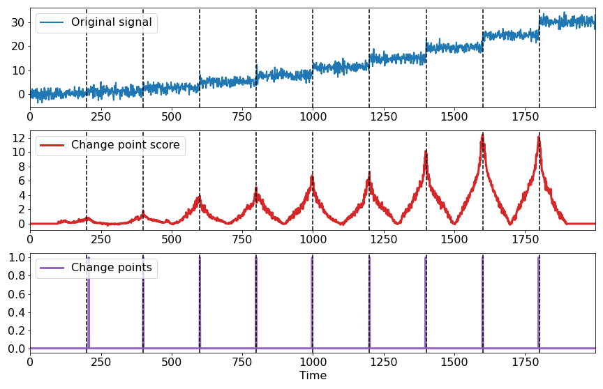

# Change point detector package

## Basic usage 

Make sure that your data has a shape `(seq_len, n_dims)` or you can generate synthetic data:
```python
import numpy as np
import roerich
 
X, label = roerich.generate_dataset(period=2000, N_tot=20000)
T = np.arange(len(X))
```

You can use two algorithms: `CLF` or `RuLSIF`: 

```python
cpd = roerich.OnlineNNClassifier(net='default', scaler="default", n_inputs=X.shape[1], metric="KL_sym",
                  periods=1, window_size=10, lag_size=500, step=10, n_epochs=100, lr=0.1,
                  lam=0.0001, optimizer="Adam"
                 )

# Detect change points
score, peaks = cpd.predict(X)
```

For data visualization use: 
```python
roerich.display(X, T, label, score, T, peaks)
```
